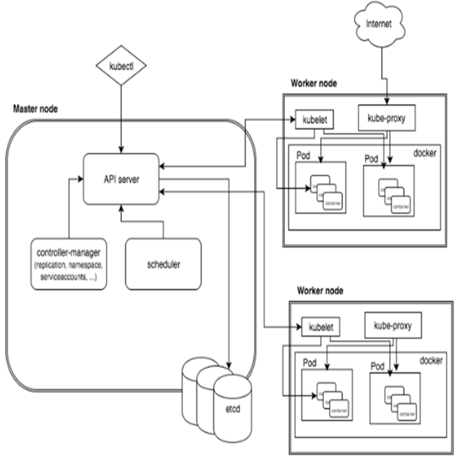

# Orchestrating Gameplay: How Temporal and Kubernetes Power MAFIA

A multiplayer Mafia game was built to explore distributed systems in a real, working application. The game has multiple phases: Night, Voting, Discussion, each with a countdown timer. Players take actions, the timer runs out, and the game moves to the next phase automatically.

Simple enough on the surface. But getting this to work reliably, without timers dying, without the game freezing, without data disappearing when a service restarts, that's where Temporal and Kubernetes come in.

## The Problem

The game runs across 5 separate services:

**Frontend** handles what players see in the browser.
**Gateway** is the entry point that handles login and routes requests.
**Game Engine** is the brain that handles game rules and phase logic.
**Event Service** manages the countdown timers.
**MongoDB** stores all game data.

Each service is its own program running in its own container.

### Problem 1: Timers that forget everything

The countdown timer for each phase was a simple background task running inside the Event Service. When the timer hit zero, it would call the Game Engine to move to the next phase.

This worked fine until the Event Service restarted due to a crash or a deployment. The moment it restarted, every active timer was gone. No record they ever existed. Players would be stuck in a phase forever with no way out.

This was the original timer code, a plain goroutine that lived only in memory:

```go
go func() {
    ticker := time.NewTicker(time.Duration(durationSec) * time.Second)
    defer ticker.Stop()
    <-ticker.C
    engineAdvancePhase(roomID)
}()
```

### Problem 2: Who is the host?

The Gateway kept track of which player created each room in a simple in-memory variable:

```python
_ROOM_HOSTS = { "room123": "Likhith" }
```

If the Gateway restarted, that variable reset to empty. Suddenly no one was the host. Clicking "Start Game" would fail with a cryptic error.

## Solution 1: Temporal

### What is Temporal?

Temporal is a tool that lets you write code that survives crashes.

Normally, if your program crashes mid execution, whatever it was doing is lost. Temporal solves this by saving the progress of your code as it runs. If the program crashes, Temporal replays the code from where it left off when it restarts.

Think of it like a video game save point, except it saves automatically at every step.

### How it was used for the phase timer

Instead of the goroutine, the timer was rewritten as a Temporal Workflow:

```go
func PhaseTimerWorkflow(ctx workflow.Context, input PhaseTimerInput) error {
    if err := workflow.Sleep(ctx, time.Duration(input.DurationSec)*time.Second); err != nil {
        return nil
    }
    return workflow.ExecuteActivity(ctx, AdvancePhase, input).Get(ctx, nil)
}
```

The key difference is that `workflow.Sleep` is not a normal sleep. It is a durable sleep. If the Event Service crashes at second 18, Temporal knows the timer had 12 seconds left. When the service restarts, it resumes the sleep with 12 seconds remaining. The players never notice anything happened.

If the call to advance the phase fails because the Game Engine is briefly down, Temporal automatically retries it with no manual intervention needed.

Every timer is also visible in the Temporal UI, a web dashboard where you can see every active timer, how long is left, and the full history of what happened.

<!-- SCREENSHOT: Add a screenshot of the Temporal UI here showing PhaseTimerWorkflow and GameLifecycleWorkflow in the workflows list -->


*A clean game in progress, exactly 2 workflows running. One PhaseTimerWorkflow counting down the current phase and one GameLifecycleWorkflow keeping the room alive.*

Before Temporal, a service restart meant timers were lost and the game would freeze. An HTTP call failure meant the phase never advanced, silently. After Temporal, service restarts resume timers automatically and failed calls are retried until they succeed.

### How it was used for the host problem

The in-memory host variable was replaced with a Temporal Workflow, one per room. This workflow holds the room state including who the host is and what phase the game is in, and keeps it alive for the entire duration of the game:

```python
@workflow.run
async def run(self, room_id: str, room_code: str, host_username: str) -> str:
    self._state = RoomState(
        room_id=room_id,
        room_code=room_code,
        host_username=host_username
    )

    await workflow.wait_condition(lambda: self._game_started_signal is not None)
    while True:
        await workflow.wait_condition(lambda: self._pending_phase is not None)
        await workflow.execute_activity(start_phase_timer_activity, ...)
```

Because Temporal saves its state to a database, the room information survives Gateway restarts. Any service can ask Temporal "who is the host of room 123?" at any time and get a correct answer.

<!-- SCREENSHOT: Add a screenshot of a single workflow detail page showing the event history of a GameLifecycleWorkflow -->


*The PhaseTimerWorkflow handles the countdown for the current phase while GameLifecycleWorkflow tracks the entire game room from start to finish.*


*Inside the GameLifecycleWorkflow, every game_started and phase_advanced signal is recorded on a timeline. Each signal triggers a start_phase_timer_activity which kicks off the next countdown.*


*A completed PhaseTimerWorkflow, started at 05:32:46 and closed at 05:33:16, exactly 30 seconds later. This is one phase timer that ran, hit zero, and advanced the game to the next phase automatically.*


## Solution 2: Kubernetes
 
### What is Kubernetes?
 
Before understanding what Kubernetes does, it helps to understand the problem it solves.
 
When you run a multiplayer game across 5 services, Frontend, Gateway, Game Engine, Event Service, and MongoDB, each running in its own container, you quickly run into a coordination problem. Who starts first? What happens when one crashes? How do you make sure the Event Service doesn't start before Temporal is ready?
 
Docker Compose answers some of these questions locally, but it has no awareness of health, no automatic recovery, and no concept of scaling. Kubernetes solves all of this.
 
**Kubernetes is a container orchestration platform.** It manages the deployment, scaling, networking, and lifecycle of containers across one or more machines. Instead of manually starting containers and watching them, you describe what you want, how many replicas, what environment variables, when it is healthy, and Kubernetes continuously works to make reality match that description.
 
### Kubernetes Architecture
 
A Kubernetes cluster is made up of two kinds of nodes.
 
The **Master Node** is the brain. It exposes the API that you talk to with `kubectl`, runs the scheduler that decides where to place containers, and continuously watches the cluster to correct any drift between desired and actual state. It stores all cluster data in `etcd`, a key-value store.
 
The **Worker Nodes** are where your actual containers run. Each worker node runs a `kubelet`, an agent that takes instructions from the master and ensures the right containers are running, and a `kube-proxy` that handles network routing between pods.
 

 
The key building blocks inside a cluster are:
 
**Pod** — the smallest deployable unit. A pod is one or more containers that share a network and storage. Pods are not meant to live forever, they are created, destroyed, and recreated on demand. Your Gateway service runs as a pod. So does your MongoDB instance.
 
**Service** — because pods are ephemeral and their IP addresses change constantly, a Service sits in front of a group of pods and gives them a stable DNS name and virtual IP. Your Gateway pod can crash and be replaced with a new IP, and the Frontend service still finds it through the same Service name.
 
**Deployment** — a higher-level object that manages pods. You tell it "I want 2 replicas of the Gateway", and it creates pods, watches them, and replaces any that die. All 5 services in this game run as Deployments.
 
**ConfigMap and Secret** — instead of hardcoding environment variables, Kubernetes stores configuration in ConfigMaps and sensitive credentials (JWT secrets, DB passwords) in Secrets. Pods read them at runtime.
 
**InitContainer** — a special container that runs before your main container starts. This is how startup ordering is solved:
 
```yaml
initContainers:
  - name: wait-for-temporal
    image: busybox
    command: ['sh', '-c', 'until nc -z temporal 7233; do sleep 3; done']
```
 
The Event Service sits and waits until it can reach Temporal on port 7233 before starting. No more services crashing because they came up too early.
 
### How Kubernetes is used in this project
 
Every service is described as a Kubernetes manifest, a YAML file that says what image to run, what environment to inject, how to check health, and how many replicas to maintain.
 
```yaml
containers:
  - name: mafia-gateway-service
    image: mafia-gateway:latest
    readinessProbe:
      httpGet:
        path: /health
        port: 8000
      periodSeconds: 5
```
 
The `readinessProbe` means Kubernetes checks `/health` every 5 seconds. If it fails, the pod is taken out of rotation. No manual monitoring needed.
 
Secrets are managed by Kubernetes and injected at runtime, nothing sensitive lives in source code:
 
```yaml
- name: JWT_SECRET
  valueFrom:
    secretKeyRef:
      name: mafia-secrets
      key: JWT_SECRET
```
 
Once all manifests are applied, the entire game comes up with one command:
 
```bash
kubectl apply -f ./k8s/manifests/
```
 
---
 
## Making Kubernetes Earn Its Place: KEDA
 
### The problem with basic Kubernetes scaling
 
Kubernetes has built-in autoscaling called **HPA (Horizontal Pod Autoscaler)**. It watches CPU and memory usage and scales pods up or down based on thresholds.
 
This sounds great until you look at what Temporal workers actually do.
 
A Temporal worker processing a game phase timer spends most of its time **sleeping**, `workflow.Sleep(30s)` is running on the Temporal server, not the worker. The worker is idle. CPU usage is near zero. HPA sees no load and never scales up, even if 50 games are queued.
 
This is the fundamental mismatch: **HPA scales on resource consumption, but Temporal workers are I/O-bound and event-driven, not CPU-bound.**
 
The right signal to scale on is the **Temporal task queue depth**, how many activities are waiting to be picked up. HPA cannot read this. KEDA can.
 
### What is KEDA?
 
**KEDA (Kubernetes Event-Driven Autoscaler)** is a Kubernetes operator that scales deployments based on external event sources, not CPU or memory. It supports over 60 scalers including databases, message queues, cloud services, and Temporal.
 
KEDA runs as a controller in your cluster. You define a `ScaledObject` that tells KEDA:
- Which deployment to scale
- What external metric to watch
- What the target threshold is
- What the min and max replicas should be
KEDA then continuously polls that metric and adjusts the deployment's replica count accordingly.
 
### Why KEDA and not anything else?
 
| Approach | Problem |
|---|---|
| HPA on CPU | Workers are idle even with 30 games running. Never scales. |
| HPA on memory | Same issue, memory is flat regardless of queue depth. |
| Manual scaling | Defeats the purpose. Someone has to watch and react. |
| Cron-based scaling | Can only scale on time, not actual load. |
| **KEDA on Temporal queue depth** | **Scales on the actual signal that matters: pending tasks.** |
 
No other autoscaler in the Kubernetes ecosystem can read a Temporal task queue. KEDA is the only tool that makes this possible without writing custom controllers.
 
### Installing KEDA
 
```bash
# Add the KEDA Helm repository
helm repo add kedacore https://kedacore.github.io/charts
helm repo update
 
# Install KEDA into its own namespace
helm install keda kedacore/keda --namespace keda --create-namespace
 
# Wait for the operator to be ready
kubectl wait --for=condition=ready pod -l app=keda-operator -n keda --timeout=120s
```
 
Verify it installed:
 
```bash
kubectl get pods -n keda
# NAME                                      READY   STATUS    RESTARTS   AGE
# keda-operator-xxx                         1/1     Running   0          30s
# keda-metrics-apiserver-xxx                1/1     Running   0          30s
```
 
### Splitting workers from the HTTP server
 
Before KEDA can scale workers independently, the Temporal worker must be a separate process from the HTTP server. In this project, both were embedded in the same container.
 
**For the Go event service**, a new entrypoint was created:
 
```go
// cmd/worker/main.go
func main() {
    c, err := temporalworker.Start()
    if err != nil {
        log.Fatalf("failed to start worker: %v", err)
    }
    defer c.Close()
 
    quit := make(chan os.Signal, 1)
    signal.Notify(quit, syscall.SIGINT, syscall.SIGTERM)
    <-quit
}
```
 
**For the Python gateway service**, a new entrypoint was created:
 
```python
# worker_main.py
async def main():
    client = await create_temporal_client()
    await run_worker(client)
 
asyncio.run(main())
```
 
The Dockerfile was updated to produce two separate images from the same codebase:
 
```dockerfile
FROM golang:1.25 AS builder
RUN go build -o event-service ./main.go
RUN go build -o event-worker ./cmd/worker
 
FROM gcr.io/distroless/static-debian12 AS server
COPY --from=builder /app/event-service .
CMD ["./event-service"]
 
FROM gcr.io/distroless/static-debian12 AS worker
COPY --from=builder /app/event-worker .
CMD ["./event-worker"]
```
 
### Deploying the worker as a separate Kubernetes Deployment
 
```yaml
apiVersion: apps/v1
kind: Deployment
metadata:
  name: mafia-event-worker
  namespace: mafia
spec:
  replicas: 1  # KEDA manages this
  selector:
    matchLabels:
      app: mafia-event-worker
  template:
    spec:
      initContainers:
        - name: wait-for-temporal
          image: busybox
          command: ['sh', '-c', 'until nc -z temporal 7233; do sleep 3; done']
      containers:
        - name: mafia-event-worker
          image: mafia-mafia-event-worker:latest
```
 
### Configuring KEDA to scale on Temporal queue depth
 
```yaml
apiVersion: keda.sh/v1alpha1
kind: ScaledObject
metadata:
  name: event-worker-scaler
  namespace: mafia
spec:
  scaleTargetRef:
    name: mafia-event-worker
  minReplicaCount: 1       # always keep 1 warm worker
  maxReplicaCount: 5       # scale up to 5 during tournament load
  pollingInterval: 10      # check queue every 10 seconds
  cooldownPeriod: 30       # wait 30s before scaling down
  triggers:
    - type: temporal
      metadata:
        endpoint: temporal.mafia.svc.cluster.local:7233
        namespace: default
        taskQueue: mafia-phase-timers
        targetQueueSize: "1"   # 1 worker per pending task
```
 
The same ScaledObject is defined for the gateway worker watching the `mafia-gateway` task queue.
 
Apply it:
 
```bash
kubectl apply -f ./k8s/manifests/10-keda-scaledobjects.yaml
```
 
Verify KEDA is watching:
 
```bash
kubectl get scaledobjects -n mafia
 
# NAME                    SCALETARGETKIND      SCALETARGETNAME        MIN   MAX   READY   ACTIVE
# event-worker-scaler     apps/v1.Deployment   mafia-event-worker     1     5     True    False
# gateway-worker-scaler   apps/v1.Deployment   mafia-gateway-worker   1     5     True    False
```
 
`READY: True` means KEDA successfully connected to Temporal and is watching the queue.
`ACTIVE: False` means no pending tasks, no games running, workers are at minimum replica count.
 
### What KEDA actually does
 
When a game starts and activities get queued in Temporal:
 
```
Game starts
    ↓
start_phase_timer_activity queued in "mafia-gateway" task queue
    ↓
KEDA polls queue depth (every 10 seconds)
    ↓
Queue depth > targetQueueSize
    ↓
KEDA tells Kubernetes: scale mafia-gateway-worker from 1 → 2
    ↓
New worker pod: Pending → Init:0/1 → PodInitializing → 1/1 Running
    ↓
Worker picks up the activity and processes it
    ↓
Queue drains
    ↓
After cooldownPeriod: scale back to 1
```
 
This was observed directly in the running cluster:
 
```
mafia-gateway-worker   0/1  Pending         ← KEDA triggered scale-up
mafia-gateway-worker   0/1  Init:0/1        ← waiting for Temporal
mafia-gateway-worker   0/1  PodInitializing ← starting
mafia-gateway-worker   1/1  Running         ← processing tasks
```
 
### Why minReplicaCount is 1, not 0
 
A natural question is: why not scale to zero when no games are running?
 
The answer is a fundamental property of how Temporal workers interact with KEDA's scaler.
 
Temporal workflows spend most of their time in `workflow.Sleep()` or `wait_condition()`. During these periods, there are **zero pending tasks in the queue**, the workflow is sleeping on the Temporal server, not consuming worker capacity.
 
KEDA's Temporal scaler watches **pending activity tasks**. When a workflow is sleeping, there are none. KEDA correctly reports `isActive: false` and would scale to zero.
 
The problem: when the sleep ends and an activity needs to run, there is a window of 10 to 30 seconds where no worker exists to pick it up. The activity sits in the queue, a player's game phase timer expires with no one to advance it, and the game appears frozen.
 
`minReplicaCount: 1` ensures there is always one warm worker ready to pick up the next activity the moment it appears, with zero cold-start latency. KEDA's value is the **scale-up**: when a tournament runs 10 concurrent games and activities are genuinely queued, KEDA automatically brings up additional workers without any manual intervention.
 
This is something HPA cannot do. HPA looks at CPU. A Temporal worker processing a 30-second timer is doing nothing between the start and end of that timer. HPA would never scale it up. KEDA understands the application-level signal.
 
### The CronJob: cleaning up abandoned rooms
 
One more Kubernetes primitive was added: a `CronJob` that runs every 15 minutes to find rooms where players abandoned a game without it completing properly.
 
```yaml
apiVersion: batch/v1
kind: CronJob
metadata:
  name: stale-room-cleanup
  namespace: mafia
spec:
  schedule: "*/15 * * * *"
  concurrencyPolicy: Forbid
  jobTemplate:
    spec:
      template:
        spec:
          containers:
            - name: cleanup
              image: mafia-mafia-gateway-service:latest
              command: ["python", "/workspace/clean_job.py"]
```
 
The cleanup script connects to Temporal, lists all `GameLifecycleWorkflow` runs that have been in `WAITING` state for more than 2 hours, and sends an `abandon_room` signal to each. This triggers the workflow's cleanup activity, cancelling the phase timer, marking the room inactive, and the workflow completes cleanly.
 
```bash
# Manually trigger to verify
kubectl create job --from=cronjob/stale-room-cleanup manual-test -n mafia
kubectl logs -n mafia -l job-name=manual-test -f
 
# Output:
# Connected to Temporal at temporal:7233
# Cleanup complete. checked=3 abandoned=2 cutoff=2026-06-14T10:16:55+00:00
```
 
This job cannot be replaced by a workflow timer, a workflow cannot signal itself to abandon. It needs an external actor. The CronJob is that actor.
 
### Verifying the complete setup
 
```bash
# 1. Check all pods are healthy
kubectl get pods -n mafia
 
# 2. Check KEDA is watching both queues
kubectl get scaledobjects -n mafia
 
# 3. Check CronJob is scheduled
kubectl get cronjobs -n mafia
 
# 4. Watch workers respond to game load
kubectl get pods -n mafia -w
# (start a game in another terminal and watch pods scale up)
```
 
### What this taught
 
Kubernetes removes the operational burden of keeping services alive: health checks, restarts, ordered startup, secret management, and rolling deploys all become declarative config rather than manual work.
 
KEDA reveals something important: the right autoscaling signal depends entirely on what your workload actually does. CPU and memory are proxies for load, and they are often wrong proxies. For Temporal workers, the task queue depth is the direct signal. Choosing the right scaler is an architectural decision, not an infrastructure one.
 
The CronJob shows that not everything fits inside a workflow. Some tasks, specifically tasks that need to act on multiple workflows from the outside, belong in scheduled jobs at the infrastructure layer.
 
Together, Kubernetes and KEDA turn the infrastructure from something you manage into something that manages itself.
