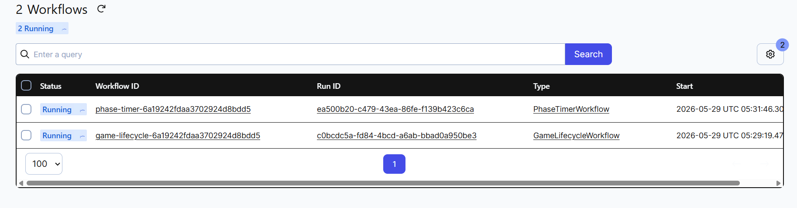
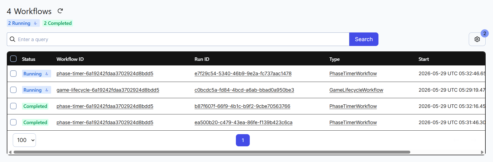
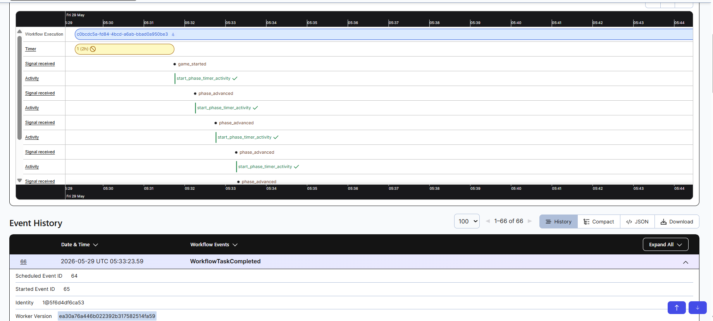
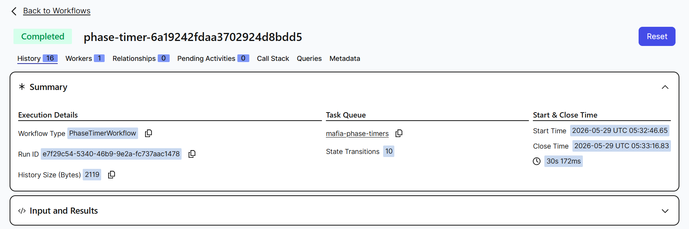

# Orchestrating Gameplay: How Temporal and Kubernetes Power MAFIA

A multiplayer Mafia game was built to explore distributed systems in a real, working application. The game has multiple phases: Night, Voting, Discussion, each with a countdown timer. Players take actions, the timer runs out, and the game moves to the next phase automatically.

Simple enough on the surface. But getting this to work reliably, without timers dying, without the game freezing, without data disappearing when a service restarts, that's where Temporal and Kubernetes come in.

## The Problem

The game runs across 5 separate services:

**Frontend** handles what players see in the browser.
**Gateway** is the entry point that handles login and routes requests.
**Game Engine** is the brain that handles game rules and phase logic.
**Event Service** manages the countdown timers.
**MongoDB** stores all game data.

Each service is its own program running in its own container.

### Problem 1: Timers that forget everything

The countdown timer for each phase was a simple background task running inside the Event Service. When the timer hit zero, it would call the Game Engine to move to the next phase.

This worked fine until the Event Service restarted due to a crash or a deployment. The moment it restarted, every active timer was gone. No record they ever existed. Players would be stuck in a phase forever with no way out.

This was the original timer code, a plain goroutine that lived only in memory:

```go
go func() {
    ticker := time.NewTicker(time.Duration(durationSec) * time.Second)
    defer ticker.Stop()
    <-ticker.C
    engineAdvancePhase(roomID) // lost forever if service restarts here
}()
```

### Problem 2: Who is the host?

The Gateway kept track of which player created each room in a simple in-memory variable:

```python
_ROOM_HOSTS = { "room123": "Likhith" }
```

If the Gateway restarted, that variable reset to empty. Suddenly no one was the host. Clicking "Start Game" would fail with a cryptic error.

## Solution 1: Temporal

### What is Temporal?

Temporal is a tool that lets you write code that survives crashes.

Normally, if your program crashes mid execution, whatever it was doing is lost. Temporal solves this by saving the progress of your code as it runs. If the program crashes, Temporal replays the code from where it left off when it restarts.

Think of it like a video game save point, except it saves automatically at every step.

### How it was used for the phase timer

Instead of the goroutine, the timer was rewritten as a Temporal Workflow:

```go
func PhaseTimerWorkflow(ctx workflow.Context, input PhaseTimerInput) error {
    // This sleep is durable. If the service crashes at second 18 of 30,
    // Temporal resumes it with 12 seconds left when the service restarts.
    if err := workflow.Sleep(ctx, time.Duration(input.DurationSec)*time.Second); err != nil {
        // Cancelled means the host manually advanced. Clean exit.
        return nil
    }

    // This HTTP call is retried automatically if it fails.
    return workflow.ExecuteActivity(ctx, AdvancePhase, input).Get(ctx, nil)
}
```

The key difference is that `workflow.Sleep` is not a normal sleep. It is a durable sleep. If the Event Service crashes at second 18, Temporal knows the timer had 12 seconds left. When the service restarts, it resumes the sleep with 12 seconds remaining. The players never notice anything happened.

If the call to advance the phase fails because the Game Engine is briefly down, Temporal automatically retries it with no manual intervention needed.

Every timer is also visible in the Temporal UI, a web dashboard where you can see every active timer, how long is left, and the full history of what happened.

<!-- SCREENSHOT: Add a screenshot of the Temporal UI here showing PhaseTimerWorkflow and GameLifecycleWorkflow in the workflows list -->


*A clean game in progress, exactly 2 workflows running. One PhaseTimerWorkflow counting down the current phase and one GameLifecycleWorkflow keeping the room alive.*

Before Temporal, a service restart meant timers were lost and the game would freeze. An HTTP call failure meant the phase never advanced, silently. After Temporal, service restarts resume timers automatically and failed calls are retried until they succeed.

### How it was used for the host problem

The in-memory host variable was replaced with a Temporal Workflow, one per room. This workflow holds the room state including who the host is and what phase the game is in, and keeps it alive for the entire duration of the game:

```python
@workflow.run
async def run(self, room_id: str, room_code: str, host_username: str) -> str:
    self._state = RoomState(
        room_id=room_id,
        room_code=room_code,
        host_username=host_username
    )
    # Wait for the game to start
    await workflow.wait_condition(lambda: self._game_started_signal is not None)

    # Phase loop, runs until the game ends
    while True:
        await workflow.wait_condition(lambda: self._pending_phase is not None)
        await workflow.execute_activity(start_phase_timer_activity, ...)
```

Because Temporal saves its state to a database, the room information survives Gateway restarts. Any service can ask Temporal "who is the host of room 123?" at any time and get a correct answer.

<!-- SCREENSHOT: Add a screenshot of a single workflow detail page showing the event history of a GameLifecycleWorkflow -->


*The PhaseTimerWorkflow handles the countdown for the current phase while GameLifecycleWorkflow tracks the entire game room from start to finish.*



*Inside the GameLifecycleWorkflow, every game_started and phase_advanced signal is recorded on a timeline. Each signal triggers a start_phase_timer_activity which kicks off the next countdown.*




*A completed PhaseTimerWorkflow — started at 05:32:46 and closed at 05:33:16, exactly 30 seconds later. This is one phase timer that ran, hit zero, and advanced the game to the next phase automatically.*


## Solution 2: Kubernetes

### What is Kubernetes?

Kubernetes is a tool that manages your containers for you.

With Docker Compose, you start all your containers with one command. But if a container crashes, you have to notice it and restart it yourself. Docker Compose has no awareness of whether your app is healthy.

Kubernetes watches your containers 24/7. If one crashes, Kubernetes restarts it automatically. If you tell Kubernetes "I want 3 copies of the Gateway running", it will always maintain exactly 3, replacing any that die.

### How it will be used

The plan is to describe the entire application to Kubernetes as a set of configuration files. Each service will have a file that says what container image to run, what environment variables it needs, how to check if it is healthy, and how many copies to run.

For example, this is what the Gateway configuration looks like:

```yaml
containers:
  - name: mafia-gateway-service
    image: mafia-gateway:latest
    readinessProbe:
      httpGet:
        path: /health
        port: 8000
      periodSeconds: 5   # check every 5 seconds, restart if it fails
```

Kubernetes will also handle startup ordering. Temporal needs its database to be ready before it starts. The Event Service needs Temporal to be ready before it starts. Each service will be configured to wait for its dependencies before starting:

```yaml
initContainers:
  - name: wait-for-temporal
    image: busybox
    command: ['sh', '-c', 'until nc -z temporal 7233; do sleep 3; done']
```

This small piece of config makes the Event Service sit and wait until Temporal is reachable on port 7233 before it starts. No more services crashing because they started too early.

### Secrets management

Currently, sensitive config like database passwords and JWT secrets live in a plain text file on the machine. With Kubernetes, these will move into a built-in Secrets store:

```yaml
- name: JWT_SECRET
  valueFrom:
    secretKeyRef:
      name: mafia-secrets
      key: JWT_SECRET
```

Containers read from Secrets at runtime, so credentials will never be hardcoded or stored in source code.

The goal is that once Kubernetes is fully in place, a container crash will be handled automatically, config will be stored securely, and health checks will run on every service with automatic recovery. No more manually restarting things when something goes down.

## How They Will Work Together

Temporal and Kubernetes solve different problems.

Temporal manages the application logic, specifically the workflows and timers, and ensures they survive crashes and failed calls. Kubernetes will manage the containers and ensure they are always running, healthy, and properly configured.

Once both are fully integrated, Kubernetes will make sure all 7 services are always running. Temporal will make sure the game logic, timers and room state, is always correct.

Neither one replaces the other. Kubernetes keeps the containers alive. Temporal keeps the application logic alive.

## Running It Locally

The setup already works locally using Minikube, a tool that creates a Kubernetes cluster inside Docker on a laptop. The cluster starts with one command:

```
minikube start --driver=docker --memory=6144 --cpus=4
```

Applying all the configuration files brings up the entire application:

```
kubectl apply -f ./k8s/manifests/
```

## What This Taught

Temporal changed how background tasks are written. Before, a timer was written and left to chance. Now every long-running task is a workflow with checkpoints, something that can be paused, resumed, and retried without losing progress.

Kubernetes is changing how deployment works. The goal is to reach a point where the infrastructure takes care of itself with health checks, restarts, and ordered startup, and the focus can stay entirely on the application.

Both tools have a learning curve. But the problems they solve are real, and once you see them working, it is hard to go back to doing things manually.
